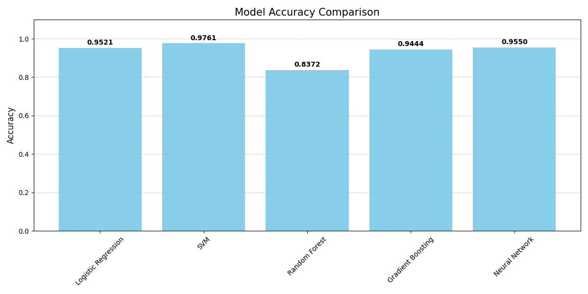

# Zoidberg


## 📊 Résultats des Comparaisons
Les résultats de la comparaison des performances des modèles d'apprentissage automatique sont présentés dans le graphique ci-dessous.



## 🎯 Objectifs du Projet
1. **Détection Automatique de Pneumonie** : Analyser des radiographies pulmonaires pour identifier les cas de pneumonie
2. **Classification Binaire** : Distinguer les images "Normales" vs "Pneumonie"
3. **Validation Scientifique** : Comparer différentes approches d'IA pour la tâche médicale

## 📂 Structure des Données
dataset1/
├── normal/
│   ├── im1.png
│   └── ... (1341 images)
└── pneumonia/
├── im3875.png
└── ... (3875 images)

## 🔧 Méthodologie Technique

### 1. Préprocessing des Images
```python
def preprocess_images(...):
    # Conversion en niveaux de gris
    # Redimensionnement 150x150 pixels
    # Application de CLAHE (Contrast Limited Adaptive Histogram Equalization)
    # Normalisation des valeurs de pixels [0-1]

Thought process
```
## 🔍 For Beginners: Understanding the Medical Image Analysis

### 🤖 How the Computer "Learns" to Diagnose

The system uses special math patterns (called "machine learning models") to analyze X-ray images. Here's a simple explanation of what's happening:

1. **Image Preparation** (Like Organizing X-Rays):
   - Convert images to black & white, numbers
   - Enhance contrast to see details better
   - Standardize sizes to 150x150 pixels

2. **Pattern Recognition** (Finding Disease Signs):
   - The computer looks for patterns in:
     - Lung texture (bumpy vs smooth)
     - Light/dark areas (fluid vs air)
     - Shape irregularities

3. **Decision Making** (Diagnosis Prediction):
   - Uses Logistic Regression (our main math tool) to:
   - Weigh different patterns
   - Calculate infection probability
   - Make final diagnosis (pneumonia/normal)

📊 **Simple Regression Analogy**:
Imagine drawing a line through a scatter plot - our model constantly adjusts this "decision boundary" to best separate pneumonia cases from normal scans.

🩺 **Medical Connection**:
The model's predictions are based on patterns found in thousands of historical X-rays, learning to recognize what pneumonia typically looks like compared to healthy lungs.
🔍 **Understanding the Model**:
- The model's accuracy is like knowing how well it can predict pneumonia cases.
- The time it takes to process an image is like how long it takes a doctor to diagnose a patient.


# Projet de Classification d'Images Médicales


## 🎯 Objectifs du Projet
1. **Détection Automatique de Pneumonie** : Analyser des radiographies pulmonaires pour identifier les cas de pneumonie
2. **Classification Binaire** : Distinguer les images "Normales" vs "Pneumonie"
3. **Validation Scientifique** : Comparer différentes approches d'IA pour la tâche médicale

## 📂 Structure des Données
```
dataset1/
├── normal/
│   ├── im1.png
│   └── ... (1341 images)
└── pneumonia/
├── im3875.png
└── ... (3875 images)
```

## 🔧 Méthodologie Technique

### 1. Préprocessing des Images

```python
def preprocess_images(...):
    # Conversion en niveaux de gris
    # Redimensionnement 150x150 pixels
    # Application de CLAHE (Contrast Limited Adaptive Histogram Equalization)
    # Normalisation des valeurs de pixels [0-1]
```

### 2. Extraction de Caractéristiques
### Approche Traditionnelle

def extract_features(images):
    # Calcul d'histogrammes de textures
    # Analyse de motifs locaux (LBP)
    # Réduction de dimension avec PCA

Approche Deep Learning :


```python
def create_cnn_model(...):
```

### - Architecture CNN avec 3 couches convolutionnelles
### - MaxPooling pour réduire la dimension spatiale
### - Couche Dense finale avec activation sigmoïde

### 3. Entraînement des Modèles
Modèles Testés :

- Régression Logistique
- SVM (Machine à Vecteurs de Support)
- Random Forest
- Gradient Boosting
- Réseau de Neurones Artificiel (MLP)
- CNN (Réseau de Neurones Convolutif)
Validation Croisée :

````python
kf = KFold(n_splits=5, shuffle=True)
for model in models:
    scores = cross_val_score(model, X, y, cv=kf)
````


## 📊 Résultats Clés


## U-MATRIX


### Visualisations
````python
def visualize_som_umatrix(...):
    # Cartographie des similarités entre cas médicaux
    # Identification de clusters pathologiques
